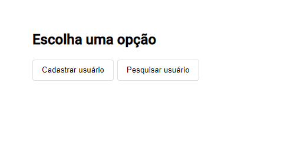
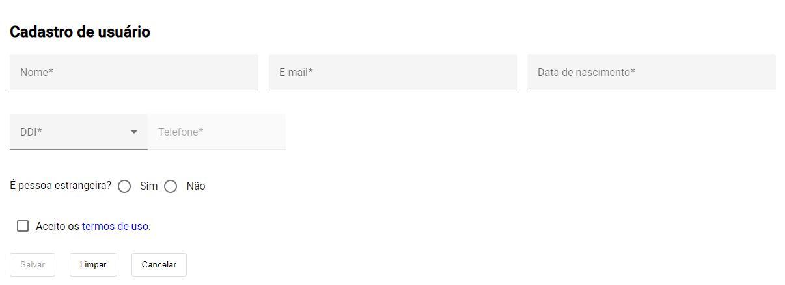
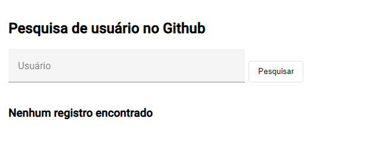
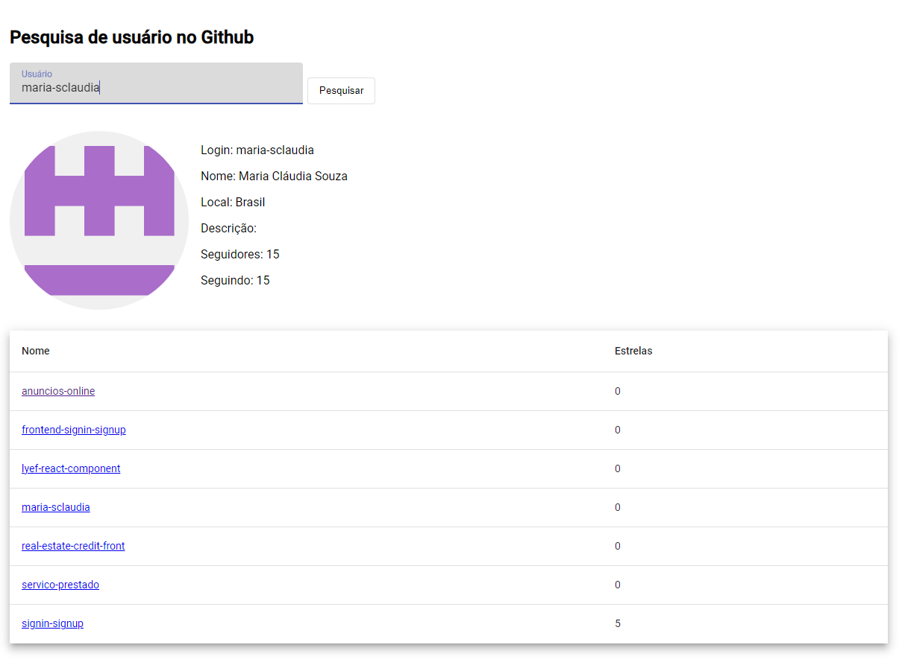

# Sobre o Projeto

Este projeto permite cadastrar um usuário e pesquisar por usuários no GitHub utilizando seu username. A pesquisa retorna uma lista dos repositórios públicos desse usuário.

## Tela Inicial

- Na tela inicial, você pode escolher entre acessar a **Tela de Cadastro de Usuário** ou a **Tela de Pesquisa de Usuário**.

## Tela de Cadastro de Usuário

Nesta tela, você encontra um formulário para cadastrar um novo usuário.

### Botões

- Salvar: Grava os dados do usuário no sistema, validando se todos os campos estão preenchidos corretamente.
- Limpar: Limpa todos os campos do formulário, permitindo que o usuário recomece o preenchimento sem salvar os dados.
- Cancelar: Retorna para a tela inicial, descartando quaisquer alterações feitas no formulário.

## Tela de Pesquisa de Usuário

Nesta tela, você pode inserir o username de um usuário do GitHub para pesquisar seus repositórios públicos. Após digitar o username, clique no botão **Pesquisar** ou pressione **Enter**. Se o usuário possuir repositórios públicos, eles serão exibidos em uma lista.

Para executar o projeto clique [aqui](./src/docs/details.md).
